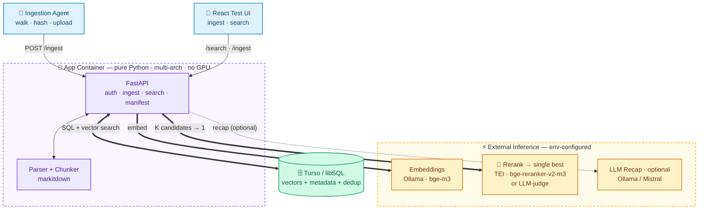

# Knowledge Ingestion & Retrieval Service — Solution Plan (v5)

> Codename TBD (placeholder: **Sift**). A minimal, self-contained alternative to "LM Studio for documents": point an agent at a path, every file gets embedded into a vector base, and a single search bar returns the **single best result** (reranked) with a recap and its source path.
>
> **v5:** scrubbed external-product coupling (this is a standalone tool); `docker-compose`, the **test Web UI**, and the **ingestion agent** are explicit deliverables; **multi-tenancy hooks** kept open for later (§10). **Carried:** modular ports & adapters; config-driven; Turso/libSQL store; external env-configured inference; two-stage retrieval with reranking.

---

## 0. Design principles (read first — these constrain everything below)

**P1 — Modular & reusable (ports & adapters).** Every seam is an interface ("port"); every implementation is an "adapter" behind it. Components talk only through ports, so each brick is independently testable (swap a fake at the boundary) and reusable.

**P2 — Config-driven.** No hardcoded values, no scattered `os.environ`. One typed config object is the single source of truth; one composition root (`factory.py`) reads it and wires the chosen adapters. Changing behaviour = changing config, not code.

**Payoff:** P1 gives interchangeable bricks, P2 chooses which snap together. Choices become config swaps at the composition root — the vector store, the embedder, the rerank strategy, the recap LLM — none baked into callers, all changeable without touching pipelines.

---

## 1. Build defaults (all reversible)

- **Thin agent** — ships raw docs; the cloud embeds. Same HTTP contract a future "smart" agent would use (which just adds an `Embedder` client-side). Start thin.
- **Single store behind the `VectorStore` port** — one libSQL DB for the PoC; because it's a port, a different vector store could slot in later with no caller changes.
- **Single tenant** — carried as a parameter through every layer from day one (see §10), so multi-tenancy is additive, not a refactor.

---

## 2. Module map (the "lego")

```
sift/
  core/                      # pure domain — ZERO external deps
    types.py                 # Document, Page, Chunk, Hit, Vector
    ports.py                 # the interfaces everything codes against
  adapters/                  # one concrete impl per port; all swappable
    embedding/
      openai_compat.py       # Ollama / Mistral / any OpenAI-compatible server
      fake.py                # deterministic test double
    rerank/                  # <-- selects the single best result
      llm_judge.py           # reuse the chat LLM to pick + justify
      crossencoder_http.py   # TEI /rerank (bge-reranker-v2-m3)
      null.py                # identity: keep vector-search order
    llm/
      openai_compat.py       # Ollama / Mistral / any OpenAI-compatible server
      null.py                # passthrough recap when LLM unset
    store/
      libsql.py              # Turso/libSQL (today)
      fake.py                # in-memory test double
      # add another store here behind the same port if ever needed
    parsing/
      markitdown.py          # docling.py later
    chunking/
      token.py
  pipelines/                 # compose ports only — never import adapters
    ingest.py                # parse -> chunk -> embed -> upsert   (takes tenant)
    search.py                # embed -> retrieve wide -> rerank -> recap (takes tenant)
  config.py                  # typed settings, single source of truth
  factory.py                 # composition root: config -> wired adapters
  api/                       # thin FastAPI; routes -> pipelines via DI
    main.py  routes.py  deps.py   # deps.py resolves request -> tenant (one place)
agent/                       # SEPARATE deployable (shares only the HTTP contract)
  cli.py  client.py
web/                         # Vite + React test UI
docker-compose.yml           # api + web; optional tei (rerank) behind a profile
```

**The ports (`core/ports.py`)** — freeze these first; they're the contract:

- `Embedder.embed(texts) -> list[Vector]`
- `Reranker.rerank(query, candidates: list[Hit]) -> list[Hit]`  *(reordered; caller takes FINAL_K)*
- `Completer.complete(system, user) -> str`  *(recap rides on this)*
- `VectorStore`: `ensure_ready(model, dim)` · `upsert(chunks)` · `search(vector, k, tenant) -> list[Hit]` · `known_hashes(tenant) -> set[str]`
- `Parser.parse(data, filename) -> Document`
- `Chunker.chunk(doc) -> list[Chunk]`

Every store method already takes `tenant` (see §10). **Dependency rule:** everything points *inward* — `adapters/` → `core`; `pipelines/` → `core` ports only; `api/` → pipelines + factory; `core/` → nothing; `agent/` fully separate. Break this and the lego fuses into a blob.

---

## 3. Architecture



Clients only talk to FastAPI. On search it embeds the query, pulls a wide candidate set from Turso, **reranks to the single best**, optionally recaps, and returns that result + path. Nothing in the app box does ML — all inference is external, env-configured calls. Each box maps to a module in §2.

---

## 4. Locked decisions

| Decision | Choice | Why |
|---|---|---|
| Topology | Inference external + env-configured | One embedder/model/space. App does no ML → hardware-agnostic, tiny image. |
| Vector store | **Turso / libSQL** behind a `VectorStore` port | Native vector search; one DB for vectors + metadata + dedup. Use libSQL via Turso Cloud, not the beta Turso Database rewrite. The port means a different store could slot in later. |
| Embedding | **`bge-m3`** via external server, behind an `Embedder` port | Multilingual (DE+EN), 1024-dim. |
| **Result selection** | **Two-stage: retrieve wide → rerank → top-1**, behind a `Reranker` port | Cosine top-1 ≠ most relevant. The reranker is the "classifier for the single best result." See §7. |
| Recap LLM | **Optional**, external, behind a `Completer` port | Set → recap; unset → best chunk verbatim. |
| Inference API surface | **OpenAI-compatible** for embed/chat; **TEI `/rerank`** for the cross-encoder | Same adapter across Ollama, **Mistral (hosted `api.mistral.ai/v1` or Mistral-in-Ollama)**, vLLM, LM Studio — change base_url + model + key. |
| Container | **One multi-arch image** (amd64 + arm64), no device detection | Same image on every host. Inference servers run separately. |
| Tech stack | **Python + FastAPI + React (Vite)** | React UI for testing. |

---

## 5. Tech stack

Python 3.12, FastAPI + Uvicorn, **pydantic-settings** for typed config. **No torch in the app** — all inference is remote HTTP. libSQL Python client (`libsql-client` / `libsql-experimental`). `httpx` (or the `openai` client at a custom base URL) for embed/chat; plain `httpx` for TEI `/rerank`. `markitdown` for parsing. React + Vite for the UI. Dev tooling: `ruff`, `pyright`/`mypy`, `pytest`.

---

## 6. Data model

Everything lives in **one libSQL database** — exact columns are up to the implementer:

- **A manifest of ingested files** (so re-runs skip unchanged ones): path, content hash, indexed-at. The hash is what the agent diffs against.
- **The chunks**: text, source file + page/section, and the embedding — a 1024-dim `bge-m3` vector in libSQL's native vector column type (`F32_BLOB`).
- **A model-pin record** (scoped per tenant — see §10): which embedding model the base was built with, and its dimension.

**The one rule that matters:** every ingest and search checks the configured `EMBED_MODEL` against the pin and refuses on mismatch — the only thing keeping the base coherent when the model is just a config string.

Search is cosine similarity over chunk vectors, filtered by tenant. Brute-force ordering is fine for the PoC; add libSQL's DiskANN index only if the corpus grows large. **Reranking adds nothing to the schema** — it runs at query time on already-retrieved candidates. **Dev:** Turso Cloud directly, or an embedded replica (local file syncing to Cloud).

---

## 7. Retrieval & the single best result (reranking)

Vector search ranks by cosine over independently-embedded vectors — great for pulling a *candidate set*, but the top-1 by cosine is often not the most relevant chunk. The fix is **two-stage retrieval**: pull a wide set, then score true query↔chunk relevance with a second model and take the best. That second model is your "classifier for the single best result."

It's a `Reranker` **port** (optional, config-selected). Flow:
`embed query → vector search RETRIEVE_K candidates (e.g. 30) → rerank → take FINAL_K (default 1) → recap the best → return {summary, path}`.

**The Ollama gotcha (don't waste time here):** stock Ollama can't do real reranking. There's no working `/api/rerank`; pulling a reranker and calling `/api/embed` returns embeddings, **not** the cross-encoder's relevance score, so the numbers are useless for ranking. Two adapters work instead — both behind the same port:

- **`llm` — LLM-as-judge (PoC default, zero new infra).** Reuse your chat model (`LLM_BASE_URL`, e.g. Mistral or any Ollama model): hand it the candidates (each with its path) and have it pick the single most relevant *and* summarize it in one call. Folds selection into the recap. Lower precision and slower per query, but fine for a handful of candidates.
- **`crossencoder` — proper reranker (the quality/speed upgrade).** **`bge-reranker-v2-m3`**, the multilingual sibling of bge-m3, served by **TEI** (Text Embeddings Inference), which exposes a real `/rerank` endpoint. POST the query + candidate texts → relevance scores → argmax. GPU on a CUDA box, CPU on a server, native binary on Apple Silicon. Accurate, fast, purpose-built.

Selected by `RERANK_STRATEGY` — ship the PoC on `llm`, switch to `crossencoder` later by config, no code change. **Combinations:** `crossencoder` + LLM recap = best chunk then summarized (two calls); `crossencoder` + no recap = best chunk verbatim + path (one call); `llm` = select + summarize in one. **Bonus:** TEI can also serve bge-m3 *embeddings*, so if you adopt the cross-encoder you can optionally consolidate embedding + reranking onto TEI and leave the chat server as just the recap LLM — config decides, the ports don't care.

---

## 8. API surface + config

- `POST /ingest` — bearer auth, multipart. → per-file status (indexed / skipped-dedup / failed).
- `GET /ingest/manifest?tenant=` — known hashes for the agent's diff.
- `GET /search?q=&k=` — embed → retrieve `RETRIEVE_K` → rerank → `FINAL_K` → recap (if LLM set). → `{summary, sources:[{path, page, score}]}`. With `FINAL_K=1`, that's the single best result + its path.
- `GET /healthz` — liveness + the pinned `embed_model`.

Every request resolves a `tenant` at the auth dependency (PoC: the shared token → `"default"`) and passes it into the pipelines (§10).

```
# config.py reads these (typed, with defaults); factory.py wires from them
STORE_BACKEND=libsql            # selector; new stores slot in behind the VectorStore port
TURSO_DATABASE_URL=             # libsql://...  or file: for embedded replica
TURSO_AUTH_TOKEN=
EMBED_BASE_URL=                 # e.g. http://ollama:11434/v1
EMBED_MODEL=bge-m3
EMBED_API_KEY=                  # optional
RERANK_STRATEGY=llm             # none | llm | crossencoder
RERANK_BASE_URL=                # crossencoder only; e.g. http://tei:80
RERANK_MODEL=bge-reranker-v2-m3
RETRIEVE_K=30                   # candidates pulled from vector search
FINAL_K=1                       # results kept after rerank (the single best)
LLM_BASE_URL=                   # recap and/or llm-judge; Ollama or https://api.mistral.ai/v1
LLM_MODEL=                      # e.g. mistral-large-latest, or any Ollama model
LLM_API_KEY=                    # optional
CHUNK_SIZE=512  CHUNK_OVERLAP=64
INGEST_TOKEN=                   # shared bearer for the PoC
```

---

## 9. Packaging & deliverables — Phase 1

**Ships:** the FastAPI service, the **React test UI**, the **ingestion agent CLI**, and a **`docker-compose.yml`** that brings the stack up.

**`docker-compose.yml`** (PoC): an `api` service (the FastAPI app) and a `web` service (Vite dev server, or the built UI behind nginx). The cross-encoder reranker is an optional `tei` service behind a compose **profile** — only started if you choose `crossencoder`. Your **inference servers run externally** (Ollama / Mistral on your own hardware) and are reached by URL — referenced via `host.docker.internal` or an env var, not bundled. **Turso** is cloud or an embedded-replica file — no container. The **agent** is a CLI you run against the API (on the host, or as a one-shot container), not a long-running service.

**In scope:** single tenant, shared bearer token, one libSQL DB, embeddings via env-configured Ollama, two-stage retrieval with reranking (`llm`-judge default, TEI cross-encoder optional), optional recap, content-hash dedup, the agent CLI, the React UI, dev on `localhost`. **Hard rule:** localhost-only — the upload endpoint must not face the internet.

**Out of scope (fine — each is a new adapter or config flip, not a rewrite):** per-agent tokens, database-per-tenant, async ingestion queue, resumable upload, parser sandboxing, file-watcher / incremental re-index, the DiskANN index, MCP server, smart-agent mode.

---

## 10. Multi-tenancy readiness (hooks now, feature later)

Multi-tenancy is *out of scope to build*, but the seams stay open so adding it later is additive, not a refactor. In place from day one:

- **`tenant` threaded through every layer.** The `VectorStore` methods (`upsert`/`search`/`known_hashes`) already take `tenant`; the API and pipelines pass it too. The PoC hardcodes `tenant='default'`, but the parameter exists everywhere — so you never retrofit it through dozens of signatures later (that's the painful part).
- **One auth→tenant chokepoint** (`api/deps.py`). PoC: shared token → `'default'`. Later: per-token or a JWT claim → real tenant. Only that one function changes.
- **Store construction stays in the factory.** Going to database-per-tenant means the factory hands back a per-tenant connection (or a tenant-routing store) without touching pipelines or the API.
- **Model-pin scoped per tenant** (per-DB if DB-per-tenant, per-row if single-DB).

When you switch it on, Turso gives two easy routes: a **single DB with a tenant column** (cheap, soft isolation — you're already filtering by the param), or **database-per-tenant** — libSQL is built for cheap on-demand per-tenant databases, giving hard isolation plus per-tenant backup/delete/migrate. The factory picks; nothing else changes.

---

## 11. Two-developer split + git flow

### The efficiency lever: freeze contracts, then build against fakes
**Step 0 — together (~1 hour, pair on it).** Write `core/types.py`, `core/ports.py`, the FastAPI request/response schemas, the **fakes** (`embedding/fake.py`, `store/fake.py`, `rerank/null.py`), and the **`docker-compose.yml` skeleton**. Merge to `main`. This is the frozen interface — after it lands, each dev codes their half against the *port* and stubs the other side with a fake.

### The split (along port boundaries — branches rarely touch the same files)

**Dev A — "the engine" (ingest + storage):** `adapters/store/libsql.py` (the gnarly one: vector SQL, model-pin, manifest, tenant filtering), `adapters/parsing/markitdown.py`, `adapters/chunking/token.py`, `pipelines/ingest.py`, and `agent/`. Tests ingest end-to-end with `FakeEmbedder` — never waits on Dev B.

**Dev B — "the surface" (retrieve + rank + serve):** `adapters/embedding/openai_compat.py`, `adapters/rerank/*` (null + llm-judge; crossencoder optional), `adapters/llm/*`, `pipelines/search.py`, `api/` + `config.py` + `factory.py` + the tenant-resolving dependency, `web/`, and the `docker-compose.yml` services. Tests search + rerank + API with `FakeVectorStore` — never waits on Dev A.

**Integration** is mechanical: in `factory.py`, swap fakes for real adapters and run the smoke test. `factory.py` is the one shared seam — treat its changes as joint. Optional `CODEOWNERS`: A owns `store`/`parsing`/`agent`; B owns `api`/`web`/`embedding`/`rerank`; `core/` co-owned.

### Git flow: trunk-based via GitHub Flow (not GitFlow)
For two people on a fast build, GitFlow's long-lived `develop`/`release`/`hotfix` branches are overhead that breeds integration drift. Lean model instead:

- **`main` always deployable**, protected: PR required, 1 review (always the other person), CI green.
- **Short-lived branches**, one per slice (`feat/libsql-store`, `feat/rerank-pipeline`). Small and frequent.
- **PR → review → squash-merge → delete.** Squash keeps `main` one-commit-per-PR and trivially revertable.
- **Merge to `main` daily.** No branch lives more than a day or two — long branches are where 2-dev teams lose time to conflicts.
- **CI per PR:** `ruff` + type-check + `pytest`. The fakes mean unit tests need no Turso/Ollama/TEI → fast CI.
- **Contract changes** (`core/` or API schema) get a dedicated small PR both review — they ripple into both halves.
- **Tag** `v0.x.0` on deploy.

The modular split makes parallel branches that don't collide; GitHub Flow keeps them short and integrated daily. That's the efficiency win.

---

## 12. Day-1 task breakdown (mapped to owners)

**Shared (Step 0):** ports, types, API schemas, fakes (incl. `rerank/null.py`), `docker-compose.yml` skeleton → merge to `main`.

**Dev A:** (1) `LibSQLStore` — schema, model-pin guard, upsert, brute-force search, `known_hashes`, tenant filtering. (2) `MarkitdownParser`. (3) `TokenChunker`. (4) `IngestPipeline`. (5) `agent/` CLI — walk → hash → GET manifest → upload new.

**Dev B:** (1) `OpenAICompatEmbedder`. (2) `Reranker` adapters — `null` + `llm_judge` (and `crossencoder_http` if a TEI box is up). (3) `OpenAICompatLLM` + `NullRecap`. (4) `SearchPipeline` — retrieve-wide → rerank → FINAL_K → recap. (5) `config.py` + `factory.py` + FastAPI routes/DI + bearer auth + tenant-resolving dependency. (6) React UI — ingest panel + search panel. (7) `docker-compose.yml` services (api + web; tei profile).

**Together (end of day):** wire real adapters in `factory.py`, `docker compose up`, run the smoke test — ingest a sample folder, search, confirm a single best result with its correct path (and recap if LLM on), re-run the agent to confirm dedup skips everything.

---

## 13. Guardrails

- **Dependency rule enforced** — nothing in `pipelines/`/`core/` imports an adapter. CI can lint this.
- **Model pin enforced** — ingest/search against a mismatched base is rejected.
- **Config is the only source of values** — no hardcoded URLs, models, tokens, dims, or K values.
- **`tenant` flows through every layer** even while single-tenant (so tenancy stays additive).
- **Auth from day 1; localhost-only for the PoC.**
- **One image for all targets** — no per-arch special-casing.

---

## 14. Confirm before writing code

Defaults you can change later, but worth a quick alignment:
1. **Rerank for the PoC** — `llm`-judge (no extra container, merges with recap) or stand up a TEI `bge-reranker-v2-m3` (`crossencoder`)?
2. **Recap** — wire a chat model on day one (Ollama or Mistral), or return the best chunk verbatim?
3. **Citation granularity** — page/section (recommended) or file-level?
4. **Corpus profile** — rough file count + types?
