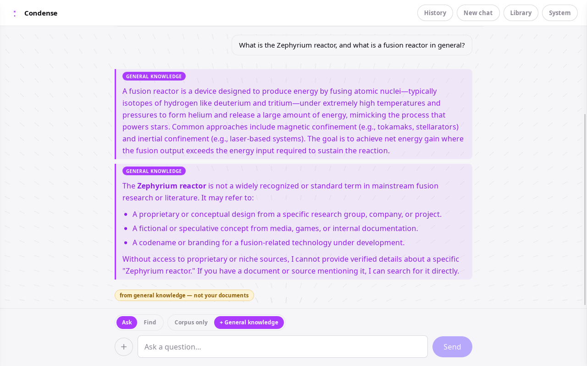
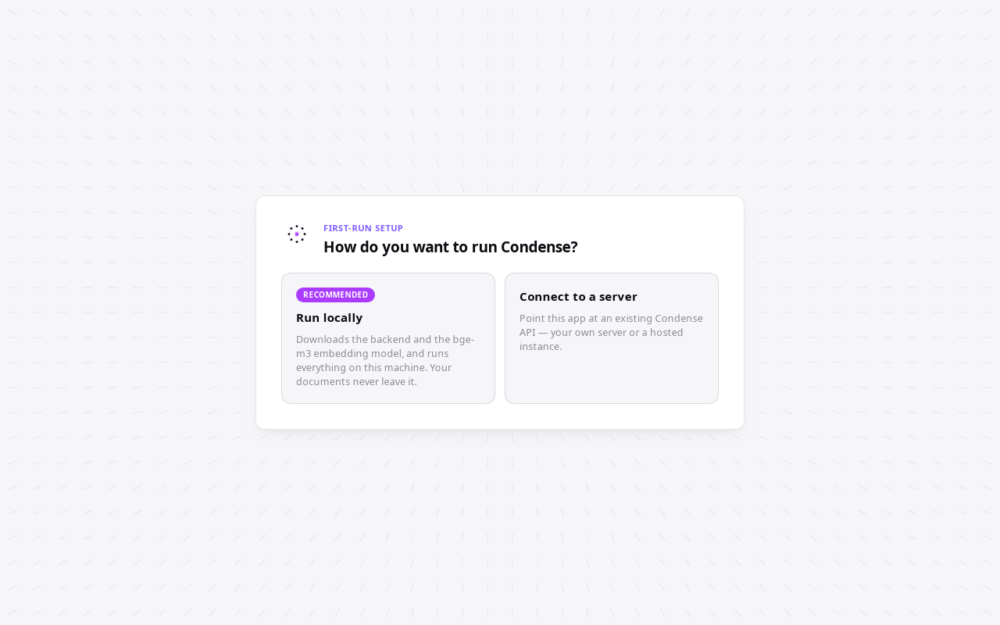
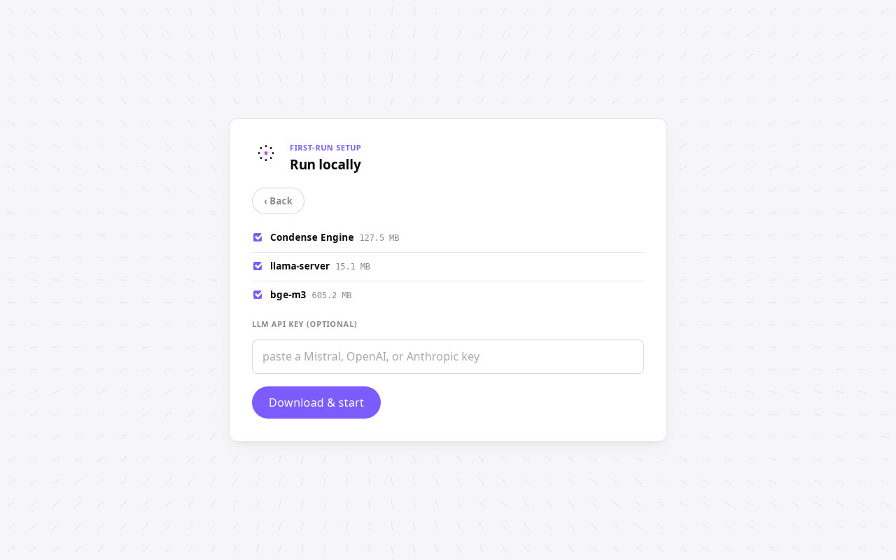
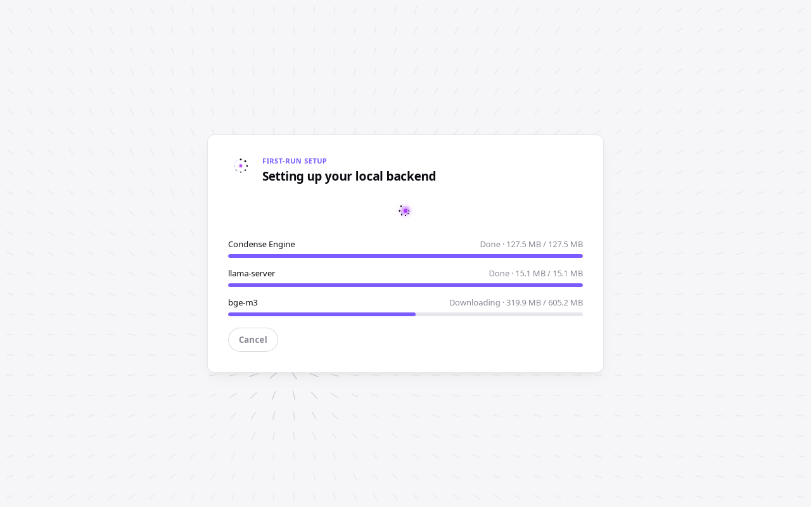
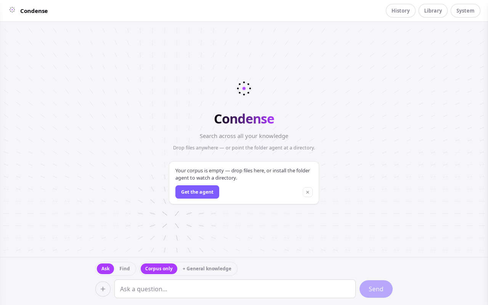
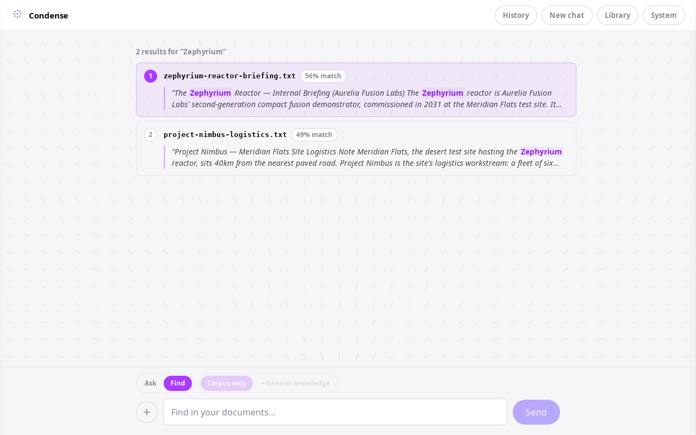

<div align="center">
  

  # Condense

  **Chat with your documents. Locally.**

  [](LICENSE)
  

  <br />

  
</div>

Point Condense at a folder, ask it a question, get an answer grounded in your own corpus —
with the exact sources it used. It runs as a small desktop app or a self-hosted server; either
way, your documents stay on your infrastructure and you bring your own LLM key.

## What is Condense

- **Grounded chat with cited sources**, in two honest modes: `Corpus only` never invents — it
  abstains if your documents don't cover the question — and `+ General knowledge` may
  supplement with the model's own knowledge, always visibly **marked purple** so you never
  mistake one for the other.
- **Find mode** — pure vector retrieval, a ranked results list, zero LLM calls. For when you
  just want the passage, not a summary.
- **A folder agent** that watches directories and keeps the index continuously up to date as
  files are added, edited, or removed.
- **Local-first and private** — the desktop app downloads and supervises its own backend
  (a local `bge-m3` embedder + a file-based libSQL database); nothing about your documents
  leaves your machine in local mode.
- **Bring your own LLM key** — Mistral, OpenAI, or Anthropic, auto-detected from the key's
  shape. No key at all still gets you Find mode.
- **MIT licensed** and source-available, top to bottom.

## Screenshots

<table>
  <tr>
    <td width="50%">
      
      <br /><sub>First-run wizard — run locally or connect to a server</sub>
    </td>
    <td width="50%">
      
      <br /><sub>Run locally — real component sizes, LLM key optional</sub>
    </td>
  </tr>
  <tr>
    <td width="50%">
      
      <br /><sub>Live provisioning — engine, embedder, and model downloading</sub>
    </td>
    <td width="50%">
      
      <br /><sub>The workbench — drop files anywhere, or point the folder agent at a directory</sub>
    </td>
  </tr>
  <tr>
    <td colspan="2" align="center">
      
      <br /><sub>Find mode — ranked retrieval, zero LLM calls</sub>
    </td>
  </tr>
</table>

## Install

### ⚡ Quick install (recommended)
```bash
curl -fsSL https://raw.githubusercontent.com/AetherisAI/condense/main/scripts/install.sh | sh
```
Detects Linux/macOS, grabs the right asset from the [latest release](https://github.com/AetherisAI/condense/releases/latest),
and installs the desktop app (no sudo, nothing outside `$HOME`). Or download a specific
platform button from [Releases](https://github.com/AetherisAI/condense/releases/latest) /
the landing page — see per-OS detail below. Add `--server-only` to install just the headless
`condense-server` bundle (engine + agent CLI, no UI, no Docker) instead; `--uninstall` reverses
either. Windows: `scripts/install-windows.ps1` (same flags, PowerShell). **macOS and Windows
installers are untested on real hardware until v0.4.0 QA** — Linux is the verified path today;
see the per-OS notes below.

### 🐧 Linux (Ubuntu 22.04+)
- **AppImage:** download `Condense_<version>_amd64.AppImage` from
  [Releases](https://github.com/AetherisAI/condense/releases), then:
  ```bash
  chmod +x Condense_<version>_amd64.AppImage
  ./Condense_<version>_amd64.AppImage
  # if that does nothing (missing FUSE/libfuse2):
  ./Condense_<version>_amd64.AppImage --appimage-extract-and-run
  ```
- **.deb:** `sudo dpkg -i condense_<version>_amd64.deb`, or install it via your file manager.
- **First public release is `v0.4.0`.** If the [Releases page](https://github.com/AetherisAI/condense/releases)
  is still empty, it's landing within days — until then, build from source below.

### 🍎 macOS / 🪟 Windows
CI builds a `.dmg` (macOS) and an NSIS `.exe`/`.msi` (Windows) installer for every tagged
release, but **neither has been verified on real hardware yet** — treat them as pre-release.
Expect an unsigned-app warning (Gatekeeper on macOS, SmartScreen on Windows): right-click →
**Open** (macOS), or **More info → Run anyway** (Windows). Hit a problem? Please
[open an issue](https://github.com/AetherisAI/condense/issues) — this is exactly the feedback
that gets these two platforms to "hardware-verified." Same Releases-page caveat as Linux above.

### 🖥️ First run
- **Run locally (recommended)** — the wizard downloads its own backend (the Condense engine +
  a `llama-server` sidecar + the `bge-m3` embedding model, ~750MB total) and starts it for you.
  Paste an LLM key (optional, provider auto-detected from its shape) or skip it — Find mode
  works with no LLM configured at all.
- **Connect to a server** — point the app at any existing Condense API: a base URL and a bearer
  token (e.g. your own `docker compose` deployment below). No download at all.

### 🐳 Server / API-only (works today)
```bash
git clone https://github.com/AetherisAI/condense.git && cd condense
cp .env.example .env
# edit .env: set INGEST_TOKEN and an LLM_* key (Mistral / OpenAI / any OpenAI-compatible endpoint)
docker compose up
```
- API at `http://localhost:8000` (interactive docs at `/docs`); web UI at `http://localhost:8080`
  — both loopback-only by default (ports configurable via `API_PORT`/`WEB_PORT` in `.env`; see
  "Security & privacy" below to expose either on your LAN).
- Optional cross-encoder reranker: `docker compose --profile tei up` (+ `RERANK_STRATEGY=crossencoder`).
- Coming with `v0.4.0`: a standalone `condense-server-<os>` bundle (engine + agent CLI + a run
  script, no Docker required) — the same artifact the desktop app downloads for itself, for
  embedding Condense as a backend elsewhere.

### 🔧 Build from source
Prereqs: **Rust ≥1.77**, **Node 22+**, **Python 3.12**. Linux desktop builds also need
`libwebkit2gtk-4.1-dev libgtk-3-dev libayatana-appindicator3-dev librsvg2-dev libxdo-dev
libsoup-3.0-dev libjavascriptcoregtk-4.1-dev build-essential pkg-config libssl-dev fakeroot
dpkg-dev` — or use the project's Docker builder image and skip the host install entirely.
```bash
python3.12 -m venv .venv && source .venv/bin/activate
pip install -e ".[store,parsing,chunking,inference,agent,dev]"
cd web && npm install && npm run build && cd ..
cd desktop && npm install && npx tauri build   # desktop/ ships with the v0.4.0 merge
```
Full architecture + design rationale: [`docs/SPEC.md`](docs/SPEC.md). Every fork-in-the-road
decision, with alternatives considered: [`docs/Quentin/DECISIONS.md`](docs/Quentin/DECISIONS.md).

## Architecture at a glance
Strict **ports & adapters**: a FastAPI engine composes pipelines against interfaces only
(embedder, reranker, completer, vector store), wired once at a single composition root
(`factory.py`) from typed config — no adapter is ever hardcoded into a pipeline. Vectors,
metadata, and dedup all live in one **libSQL** database using its native vector search — no
separate vector DB. Every ML call — embeddings, reranking, the LLM — happens **external, over
HTTP**; the app itself never imports torch. The desktop shell (Tauri 2) wraps this same engine
plus a local `llama-server`/`bge-m3` embedder as child processes it supervises; the server
deployment runs the identical engine in Docker. Full spec: [`docs/SPEC.md`](docs/SPEC.md).

## Security & privacy
- **`docker compose up` publishes every port to `127.0.0.1` (loopback) only, by default** — the
  API, the web UI, and the optional `tei` reranker are unreachable from other machines out of
  the box, even on a host with a public IP.
- To reach a `docker compose` deployment from another machine on your LAN (e.g. the co-dev
  topology this repo was built for), opt in explicitly: set `API_HOST=0.0.0.0` and/or
  `WEB_HOST=0.0.0.0` in `.env` (a specific interface IP works too) and keep the bearer token
  set — it still gates every write and query. **Never set these to `0.0.0.0` — or otherwise
  port-forward any of these ports — on a host reachable from the public internet.** Condense has
  no additional network hardening (rate limiting, TLS termination, etc.); it is designed to be
  reached over a trusted private LAN, not the open internet.
- A single bearer token (`INGEST_TOKEN`, plus optional per-consumer `AUTH_TOKENS`) gates every
  write and query, on or off the LAN.
- In local desktop mode, your documents, their embeddings, and the libSQL database never leave
  your machine.
- The only outbound calls Condense ever makes are to the embedding/rerank/LLM providers **you
  configure** — nothing else, nowhere else.

## Project
```
condense/
  src/sift/    the engine — core (ports/types), adapters, pipelines, api
  web/         React + Vite workbench UI
  agent/       the folder-watching ingestion agent (CLI + Tkinter download)
  desktop/     Tauri 2 desktop shell (ships with v0.4.0)
  packaging/   PyInstaller build scripts for the agent + engine bundles
  docs/        SPEC.md (original architecture spec), Quentin/ + Arthur/ (planning, decisions)
```
- Full architecture spec: [`docs/SPEC.md`](docs/SPEC.md)
- Roadmap: [`docs/Quentin/ROADMAP.md`](docs/Quentin/ROADMAP.md)
- Decision log: [`docs/Quentin/DECISIONS.md`](docs/Quentin/DECISIONS.md)
- Contributing: issues and PRs are welcome — there's no formal process yet.
- License: [MIT](LICENSE).

---

<div align="center">
  Built by <strong>Quentin Latimier</strong> & <strong>Arthur Rapp</strong> — AetherisAI
</div>
