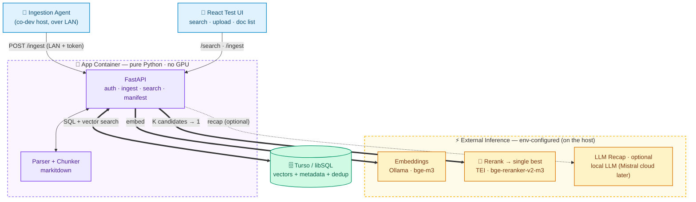

> Original architecture spec (project inception). Kept verbatim for the § references used across docs/. For current product docs see the root README.

# Knowledge Ingestion & Retrieval Service — Solution Plan (v6)

> Codename TBD (placeholder: **Sift**). A minimal, self-contained "RAG as a Lego block": point an agent at a path, every file gets embedded into a vector base, and a single search returns the **single best result** (reranked) with a recap and its source path. Not chat-first — a layer other apps and agents plug into.
>
> **v6 resolves:** one shared embedder (**bge-m3**); reranker default is the **TEI cross-encoder** (`bge-reranker-v2-m3`), LLM-judge as the fallback; dev runs as **one instance on the strong host, reached over LAN**; **English now** (bge-m3 keeps DE/FR open without a re-embed); MCP deferred; minimal custom React UI; **weekend** timeline.

---

## Quickstart (run it locally)

Condense needs three things at runtime, all over HTTP: an **embeddings** endpoint, a **vector store** (libSQL — a local file is fine), and optionally an **LLM** for the recap. The fastest local setup uses **Ollama** for embeddings and a hosted **LLM** for the recap.

### Prerequisites
- **Python 3.12** and **Node 20+** (for the web UI).
- **[Ollama](https://ollama.com)** with the embedding model pulled: `ollama pull bge-m3` (serves an OpenAI-compatible API on `:11434`).
- *(optional)* an OpenAI-compatible **LLM** for the recap — e.g. a [Mistral](https://console.mistral.ai) API key. Without one, run with the recap off (set `RERANK_STRATEGY=none`).
- *(optional)* **Docker** (e.g. [Colima](https://github.com/abiosoft/colima)) only if you want the TEI cross-encoder reranker instead of the LLM judge.

### 1. Install
```bash
python3.12 -m venv .venv && source .venv/bin/activate
pip install -e ".[store,parsing,chunking,inference,dev]"   # engine + adapters + dev tools
cd web && npm install && cd ..                              # web UI deps
```

### 2. Configure — create a `.env` in the repo root (gitignored)
```bash
STORE_BACKEND=libsql
TURSO_DATABASE_URL=file:./sift.db          # local file; or a Turso URL + TURSO_AUTH_TOKEN
EMBED_BASE_URL=http://localhost:11434/v1   # host Ollama (OpenAI-compatible)
EMBED_MODEL=bge-m3
EMBED_API_KEY=ollama                        # any non-empty value for Ollama
INGEST_TOKEN=choose-a-secret                # required — the bearer token the UI/API use

# Recap (optional): set these for an AI summary, or use RERANK_STRATEGY=none to skip the LLM
RERANK_STRATEGY=llm                         # llm = LLM-judge rerank + recap; none = no LLM
LLM_BASE_URL=https://api.mistral.ai/v1
LLM_MODEL=mistral-small-latest
LLM_API_KEY=your-llm-key
```
All keys and defaults are documented in [§8](#8-api-surface--config).

### 3. Run
```bash
# terminal 1 — the API (FastAPI on :8000)
.venv/bin/python -m uvicorn sift.api.main:app --host 127.0.0.1 --port 8000

# terminal 2 — the web UI (Vite on :5173, proxies the API)
cd web && npm run dev
```
Open **http://localhost:5173**, paste your `INGEST_TOKEN`, drag in some documents (PDF/Office/Markdown/…), then ask a question — you get the **single best answer** with its source. The top-right **System** panel shows live health, the effective config (editable on the fly), and a link to the interactive **API docs** (`/docs`).

### Use it without the UI
Everything is a plain HTTP API — explore it at **http://localhost:8000/docs** (Swagger). The core calls:
```bash
TOKEN=choose-a-secret
# ingest one or more files
curl -H "Authorization: Bearer $TOKEN" -F "files=@./report.pdf" http://localhost:8000/ingest
# search (recap=false → just the source + passage, no LLM)
curl -H "Authorization: Bearer $TOKEN" --get --data-urlencode "q=your question" \
     --data-urlencode "recap=true" http://localhost:8000/search
```

### Optional — cross-encoder reranker (TEI via Docker)
```bash
colima start                                       # or any Docker engine
docker compose --profile tei up -d tei             # bge-reranker-v2-m3 on :8081
# then set in .env: RERANK_STRATEGY=crossencoder  ·  RERANK_BASE_URL=http://localhost:8081
```

### Develop & test
```bash
pytest                 # backend tests
ruff check . && pyright
cd web && npm run build && npm run lint
```

---

## 0. Design principles (read first)

**P1 — Modular & reusable (ports & adapters).** Every seam is an interface ("port"); every implementation an "adapter" behind it. Components talk only through ports — independently testable (swap a fake), reusable (drop the same brick into another app).

**P2 — Config-driven.** No hardcoded values, no scattered `os.environ`. One typed config object is the single source of truth; one composition root (`factory.py`) reads it and wires the chosen adapters. Behaviour changes via config, not code.

**Payoff:** interchangeable bricks (P1), composed by config (P2). The store, embedder, rerank strategy, and recap LLM are all chosen at the composition root — none baked into callers.

---

## 1. Build decisions

- **One shared embedder — `bge-m3`.** Text → vector. English now, but bge-m3 is multilingual, so DE/FR can be added later **without re-embedding** (which the model-pin rule would otherwise force). Runs locally via Ollama; light enough (~560M) to run on either machine.
- **Thin agent** — ships raw docs; the host embeds. Same HTTP contract a future "smart" agent would use. It runs on the co-dev's machine and feeds the host over the LAN.
- **Single store behind the `VectorStore` port** — one libSQL DB; a different store could slot in later with no caller changes.
- **Single tenant** — carried as a parameter through every layer from day one (§10), so multi-tenancy is additive, not a refactor.
- **Reranker default: cross-encoder** (`bge-reranker-v2-m3` via TEI); LLM-judge behind the same port as the lean-cloud fallback (§7).

---

## 2. Module map (the "lego")

```
sift/
  core/                      # pure domain — ZERO external deps
    types.py                 # Document, Page, Chunk, Hit, Vector
    ports.py                 # the interfaces everything codes against
  adapters/                  # one concrete impl per port; all swappable
    embedding/
      openai_compat.py       # Ollama (bge-m3) / any OpenAI-compatible server
      fake.py                # deterministic test double
    rerank/                  # selects the single best result
      crossencoder_http.py   # TEI /rerank (bge-reranker-v2-m3)  <-- default
      llm_judge.py           # reuse the chat LLM to pick + justify (fallback)
      null.py                # identity: keep vector-search order
    llm/
      openai_compat.py       # local LLM now; Mistral cloud later, same adapter
      null.py                # passthrough recap when LLM unset
    store/
      libsql.py              # Turso/libSQL
      fake.py                # in-memory test double
    parsing/
      markitdown.py          # Word/Excel/text/PDF -> text
    chunking/
      token.py
  pipelines/                 # compose ports only — never import adapters
    ingest.py                # parse -> chunk -> embed -> upsert   (takes tenant)
    search.py                # embed -> retrieve wide -> rerank -> recap (takes tenant)
  config.py                  # typed settings, single source of truth
  factory.py                 # composition root: config -> wired adapters
  api/
    main.py  routes.py  deps.py   # deps.py resolves request -> tenant (one place)
agent/                       # SEPARATE deployable (shares only the HTTP contract)
  cli.py  client.py          # runs on the co-dev's host, targets the LAN server
web/                         # Vite + React test UI (search + upload + doc list)
docker-compose.yml           # api + web; tei (reranker) + optional local-LLM
```

**The ports (`core/ports.py`)** — freeze these first:

- `Embedder.embed(texts) -> list[Vector]`
- `Reranker.rerank(query, candidates: list[Hit]) -> list[Hit]`  *(reordered; caller takes FINAL_K)*
- `Completer.complete(system, user) -> str`  *(recap)*
- `VectorStore`: `ensure_ready(model, dim)` · `upsert(chunks)` · `search(vector, k, tenant) -> list[Hit]` · `known_hashes(tenant) -> set[str]`
- `Parser.parse(data, filename) -> Document`
- `Chunker.chunk(doc) -> list[Chunk]`

**Dependency rule:** everything points inward — `adapters/` → `core`; `pipelines/` → `core` ports only; `api/` → pipelines + factory; `core/` → nothing; `agent/` fully separate.

---

## 3. Architecture



Clients talk only to FastAPI. On search it embeds the query, pulls a wide candidate set from Turso, **reranks to the single best**, optionally recaps, and returns that result + path. Inference is external env-configured calls running on the host; the app box does no ML.

---

## 4. Locked decisions

| Decision | Choice | Why |
|---|---|---|
| Topology | Inference external + env-configured; one instance on the strong host, reached over LAN | App does no ML → hardware-agnostic, tiny image. Co-dev connects over the network. |
| Vector store | **Turso / libSQL** behind a `VectorStore` port | Native vector search (BYO embeddings); one DB for vectors + metadata + dedup. Use libSQL via Turso Cloud, not the beta Turso Database rewrite. (Vector search is officially beta.) |
| Embedder | **`bge-m3`** via Ollama, behind an `Embedder` port | One shared model. Multilingual headroom; English now. Turso does **not** embed — this is a separate layer. |
| **Result selection** | **Cross-encoder** (`bge-reranker-v2-m3` via TEI), behind a `Reranker` port | Purpose-trained, calibrated, fast. The host runs it easily. LLM-judge is the fallback. See §7. |
| Recap LLM | **Optional**, external, behind a `Completer` port | Set → recap; unset → best chunk verbatim. Local LLM now; Mistral cloud later (same adapter). |
| Inference API surface | **OpenAI-compatible** for embed/chat; **TEI `/rerank`** for the cross-encoder | Same adapter across Ollama, Mistral (`api.mistral.ai/v1` or Mistral-in-Ollama), vLLM. |
| Tech stack | **Python + FastAPI + pydantic + React (Vite)** | React UI for testing only. |

---

## 5. Tech stack

Python 3.12, FastAPI + Uvicorn, **pydantic-settings** for typed config. **No torch in the app** — all inference is remote HTTP. libSQL Python client (`libsql-client` / `libsql-experimental`). `httpx` (or the `openai` client at a custom base URL) for embed/chat; plain `httpx` for TEI `/rerank`. `markitdown` for parsing. React + Vite for the UI. Dev tooling: `ruff`, `pyright`/`mypy`, `pytest`.

---

## 6. Data model

Everything lives in **one libSQL database** — exact columns are up to the implementer:

- **A manifest of ingested files** (so re-runs skip unchanged ones): path, content hash, indexed-at. The hash is what the agent diffs against.
- **The chunks**: text, source file + page/section, and the embedding — a 1024-dim `bge-m3` vector in libSQL's native vector column type (`F32_BLOB`). *(Embeddings come from the embedder; Turso stores them.)*
- **A model-pin record** (scoped per tenant — §10): which embedding model the base was built with, and its dimension.

**The one rule that matters:** every ingest and search checks the configured `EMBED_MODEL` against the pin and refuses on mismatch — the only thing keeping the base coherent when the model is just a config string.

Search is cosine similarity over chunk vectors, filtered by tenant. Brute-force ordering is fine for the PoC; add libSQL's DiskANN index only if the corpus grows large. **Reranking adds nothing to the schema** — it runs at query time on retrieved candidates. **Dev:** Turso Cloud directly, or an embedded replica (local file syncing to Cloud).

---

## 7. Retrieval & the single best result (reranking)

Two-stage retrieval: vector search pulls a wide *candidate set* (cosine top-1 is often not the most relevant), then a second model scores true query↔chunk relevance and you take the best. Flow:
`embed query → vector search RETRIEVE_K candidates (≈30) → rerank → take FINAL_K (=1) → recap the best → return {summary, path}`.

It's a `Reranker` port with two adapters; config picks. **They are not equivalent:**

- **`crossencoder` (default) — `bge-reranker-v2-m3` via TEI.** Purpose-trained for relevance ranking: reads each (query, passage) pair, outputs a calibrated, thresholdable score. Small (~568M), fast (one batched pass over the candidates), runs easily on the host (TEI has an Apple-Silicon binary; Docker CPU also fine for small batches). The right tool for "the single best result." **Note:** stock Ollama can't do this — no working `/api/rerank`; it must be TEI (or another real `/rerank` server).
- **`llm` (fallback) — LLM-as-judge.** Prompt the chat model to pick + summarize in one call. Reuses existing infra and folds into the recap, but it's a *generative* model not trained for ranking: less consistent, position-biased, uncalibrated, slower, and weaker on a smaller local model. Reach for it in a lean cloud deploy where you don't want to host TEI.

`RERANK_STRATEGY` selects the adapter, so you can start with `null` (vector-only) to get the pipeline green, switch on `crossencoder` for quality, and keep `llm` as the cloud fallback — no code change. **Combinations:** `crossencoder` + LLM recap = best chunk, then summarized (two calls — the planned default); `crossencoder` + no recap = best chunk verbatim + path (one call); `llm` = select + summarize in one.

---

## 8. API surface + config

- `POST /ingest` — bearer auth, multipart. → per-file status (indexed / skipped-dedup / failed).
- `GET /ingest/manifest?tenant=` — known hashes for the agent's diff; also backs the UI's document list.
- `GET /search?q=&k=` — embed → retrieve `RETRIEVE_K` → rerank → `FINAL_K` → recap (if LLM set). → `{summary, sources:[{path, page, score}]}`. With `FINAL_K=1`, the single best result + its path.
- `GET /healthz` — liveness + the pinned `embed_model`.

Every request resolves a `tenant` at the auth dependency (PoC: shared token → `"default"`) and passes it into the pipelines (§10).

```
# config.py reads these (typed, with defaults); factory.py wires from them
STORE_BACKEND=libsql            # selector; new stores slot in behind the VectorStore port
TURSO_DATABASE_URL=             # libsql://...  or file: for embedded replica
TURSO_AUTH_TOKEN=
EMBED_BASE_URL=                 # host Ollama, e.g. http://localhost:11434/v1
EMBED_MODEL=bge-m3
EMBED_API_KEY=                  # optional
EMBED_BATCH_SIZE=64             # texts per embeddings call; keep <= backend's concurrency limit
EMBED_TIMEOUT_S=60.0            # read/write budget once connected
EMBED_CONNECT_TIMEOUT_S=5.0     # fails fast if the backend never answers
EMBED_RETRY_ATTEMPTS=3          # bounded retry (0.5s/2s/8s) on HTTP 429 only (D34)
RERANK_STRATEGY=crossencoder    # crossencoder (default) | llm | none
RERANK_BASE_URL=                # TEI, e.g. http://localhost:8080
RERANK_MODEL=bge-reranker-v2-m3
RETRIEVE_K=30                   # candidates pulled from vector search
FINAL_K=1                       # results kept after rerank (the single best)
VERSION_COLLAPSE_ENABLED=true   # fold near-dup passages, keep the most recently modified (D27/D28)
VERSION_SIMILARITY_THRESHOLD=0.8
LLM_BASE_URL=                   # local LLM now; https://api.mistral.ai/v1 later
LLM_MODEL=                      # e.g. a local Gemma model, or mistral-large-latest
LLM_API_KEY=                    # optional
OCR_TIMEOUT_S=60.0              # OCR fallback bounded timeouts, same rationale as EMBED_* above
OCR_CONNECT_TIMEOUT_S=5.0
CHUNK_SIZE=512  CHUNK_OVERLAP=64
PARSE_MAX_XLSX_CELLS=2000000    # reject an implausible xlsx used-range before parsing it (D34)
INGEST_TOKEN=                   # shared bearer; required even on the LAN
API_BIND=0.0.0.0                # listen on the LAN interface (private network only)
```

---

## 9. Packaging, deliverables & runtime topology — weekend build

**Ships:** the FastAPI service, the **React test UI** (search box + document upload + document list from Turso), the **ingestion agent CLI**, and a **`docker-compose.yml`**.

**Runtime topology (dev/PoC):** one instance runs on the **strong host machine** — API + Turso (cloud or embedded file) + Ollama serving bge-m3 + a local LLM for recap + the TEI reranker + the web UI. The **co-dev connects over the LAN**: either runs the **ingestion agent on his own host** (targeting the host's LAN IP + token) to feed his documents, or opens the **web UI** in his browser. This naturally exercises the networked agent + multi-host access from day one.

**`docker-compose.yml`:** an `api` service, a `web` service (Vite dev server or built UI behind nginx), a `tei` service for the reranker, and optionally a local-LLM service (or point `LLM_BASE_URL` at host Ollama). Ollama serving bge-m3 runs on the host (Metal) and is reached by URL. Turso is cloud or an embedded-replica file — no container.

**Hard rule:** **private LAN + bearer token only — never port-forward to the public internet.** Bind to the LAN interface, keep the token on ingest (and search).

**In scope:** single tenant, shared token, one libSQL DB, bge-m3 embeddings via host Ollama, two-stage retrieval with the TEI cross-encoder, optional recap via a local LLM, content-hash dedup, the agent CLI, the React UI, LAN access.

**Out of scope (each is a new adapter or config flip, not a rewrite):** per-agent tokens, database-per-tenant, async ingestion queue, resumable upload, parser sandboxing, file-watcher / incremental re-index, the DiskANN index, **MCP server**, smart-agent mode, cloud (Mistral) deployment.

---

## 10. Multi-tenancy readiness (hooks now, feature later)

Out of scope to build, but the seams stay open so it's additive later:

- **`tenant` threaded through every layer.** `VectorStore` methods already take `tenant`; the API and pipelines pass it too. PoC hardcodes `'default'`, but the parameter exists everywhere — no painful retrofit later.
- **One auth→tenant chokepoint** (`api/deps.py`). Later: per-token or JWT claim → real tenant; only that function changes.
- **Store construction stays in the factory** — database-per-tenant means the factory hands back a per-tenant connection without touching pipelines.
- **Model-pin scoped per tenant.**

Turso is built for this — its many-database architecture gives every agent/tenant its own cheap, instantly-available database (hard isolation, per-tenant backup/delete). When you switch it on: single DB + tenant column (soft), or database-per-tenant (hard). The factory picks; nothing else changes.

---

## 11. Two-developer workflow + git flow

### Freeze contracts, then build against fakes
**Step 0 — together (~1 hour, pair).** Write `core/types.py`, `core/ports.py`, the FastAPI request/response schemas, the **fakes** (`embedding/fake.py`, `store/fake.py`, `rerank/null.py`), and the `docker-compose.yml` skeleton. Merge to `main`. After this, each dev codes their half against the *port* and stubs the other side with a fake.

### Split the *code* by subsystem (not by local/cloud)
Local-vs-cloud is a config axis, not a code split — so divide ownership and share one codebase:

- **Dev A — engine (ingest + storage):** `adapters/store/libsql.py` (vector SQL, model-pin, manifest, tenant filtering), `parsing/markitdown.py`, `chunking/token.py`, `pipelines/ingest.py`, `agent/`. Tests with `FakeEmbedder`.
- **Dev B — surface (retrieve + rank + serve):** `adapters/embedding/openai_compat.py`, `adapters/rerank/*` (crossencoder + null; llm-judge), `adapters/llm/*`, `pipelines/search.py`, `api/` + `config.py` + `factory.py` + tenant dependency, `web/`, the compose services. Tests with `FakeVectorStore`.

### Integration via the shared host instance
Rather than each running a full prod stack, the **strong host runs the integration instance over the LAN**. Each dev still runs a local instance (with fakes) for fast unit iteration; after merges, redeploy the host instance from `main` and both test against it over the LAN. `factory.py` is the one shared seam — treat its changes as joint.

### Git flow: trunk-based via GitHub Flow (not GitFlow)
For two people on a weekend, GitFlow's long-lived branches breed drift. Instead:

- **`main` always deployable**, protected: PR required, 1 review (the other person), CI green.
- **Short-lived branches** (`feat/libsql-store`, `feat/rerank-pipeline`); small and frequent.
- **PR → review → squash-merge → delete.** One commit per PR on `main`, trivially revertable.
- **Merge to `main` daily.** No branch lives more than a day.
- **CI per PR:** `ruff` + type-check + `pytest`. Fakes mean unit tests need no Turso/Ollama/TEI → fast CI.
- **Contract changes** (`core/` or API schema) → dedicated small PR both review.

---

## 12. Weekend task breakdown (mapped to owners)

**Shared (Step 0):** ports, types, API schemas, fakes (incl. `rerank/null.py`), compose skeleton → `main`.

**Dev A:** (1) `LibSQLStore` — schema, model-pin guard, upsert, brute-force search, `known_hashes`, tenant filtering. (2) `MarkitdownParser`. (3) `TokenChunker`. (4) `IngestPipeline`. (5) `agent/` CLI — walk → hash → GET manifest → upload new, over the LAN.

**Dev B:** (1) `OpenAICompatEmbedder` (host Ollama / bge-m3). (2) `Reranker` adapters — `crossencoder_http` (TEI) + `null`; `llm_judge` as fallback. (3) `OpenAICompatLLM` + `NullRecap`. (4) `SearchPipeline` — retrieve-wide → rerank → FINAL_K → recap. (5) `config.py` + `factory.py` + FastAPI routes/DI + bearer auth + tenant dependency + LAN bind. (6) React UI — search + upload + document list. (7) compose services (api + web + tei).

**Together (end of weekend):** wire real adapters in `factory.py`, `docker compose up` on the host, run the smoke test from the co-dev's machine over the LAN — ingest a sample folder via the agent, search via the UI, confirm a single best result with its correct path and a recap, re-run the agent to confirm dedup skips everything.

---

## 13. Guardrails

- **Dependency rule enforced** — nothing in `pipelines/`/`core/` imports an adapter. CI can lint this.
- **Model pin enforced** — ingest/search against a mismatched base is rejected.
- **Config is the only source of values** — no hardcoded URLs, models, tokens, dims, or K values.
- **`tenant` flows through every layer** even while single-tenant.
- **Private LAN + bearer token only** — never exposed to the public internet.
- **One image for all targets** — no per-arch special-casing.

---

## 14. Settled — ready to build

Embedder (bge-m3, shared), store (Turso/libSQL), reranker (TEI cross-encoder default, LLM-judge fallback), recap (local LLM, optional), topology (one host instance over LAN), language (English now), UI (minimal: search + upload + doc list), MCP (deferred), timeline (weekend). Remaining nice-to-confirm: citation granularity (page/section recommended vs file-level) and rough corpus size/types.
